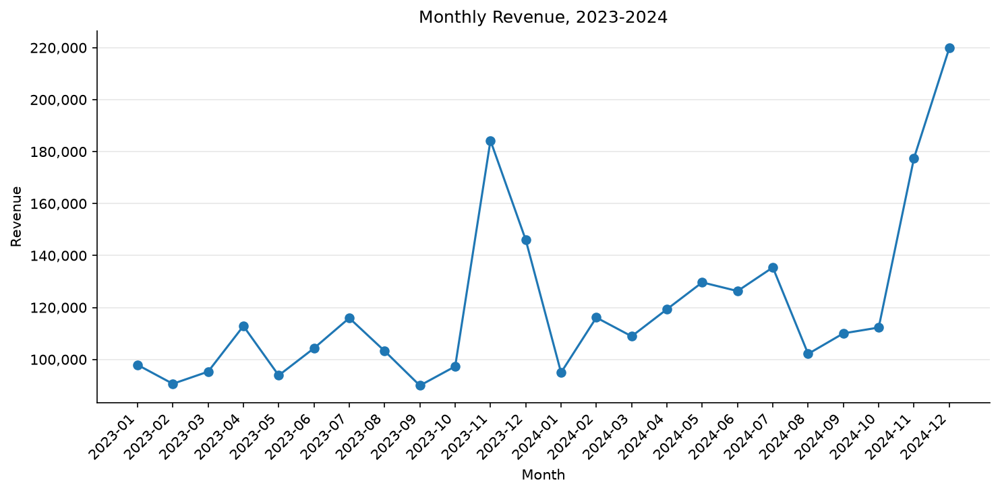
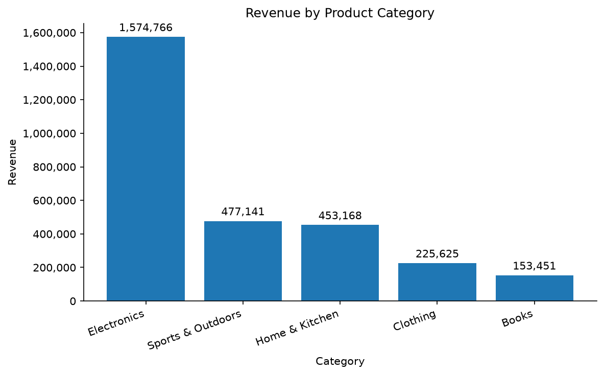
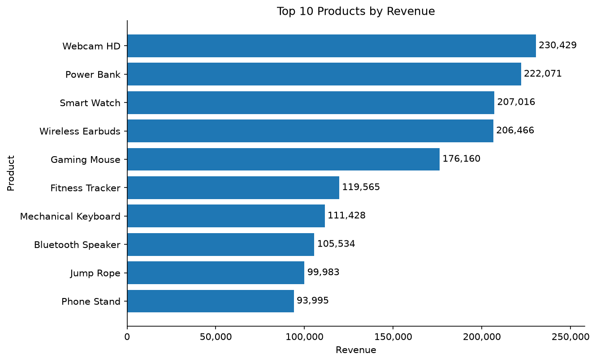
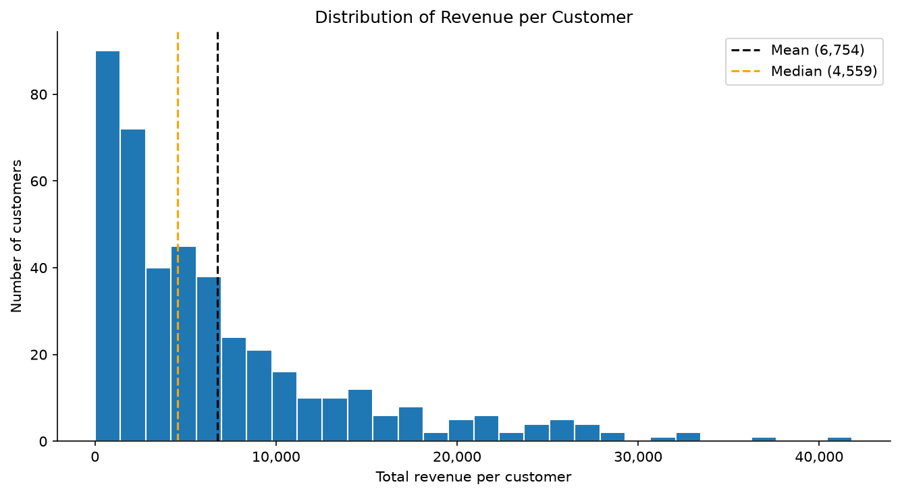

# E-Commerce Sales & Customer Analytics

**SQL and Python-based analysis of sales, products, customers, and business performance**

## Overview

This project analyses an e-commerce dataset from end to end: raw data, data cleaning, a SQLite database, SQL analysis, Pandas and NumPy analysis, charts, and business recommendations.

> **Important:** the dataset is **synthetic**. It is generated by `src/generate_data.py`, so the patterns in it reflect how the data was generated. The purpose of the project is to demonstrate the analysis workflow, not to report facts about a real business.

## Business Problem

An online shop wants to understand where its revenue comes from and what it should monitor. Which products, categories, customers, and countries matter most? How does revenue change over time? Are there products that sell many units but earn little?

## Objectives

- Measure total sales, orders, customers, and average order value
- Analyse sales over time and find the highest and lowest months
- Find the top products and categories by revenue and by units sold
- Identify the most valuable customers and customer segments
- Compare countries by revenue and order behaviour
- Turn the results into clear findings and cautious recommendations

## Dataset

**Source:** generated by `src/generate_data.py` (a fixed random seed makes the data repeatable). No external data is used, so there are no licence restrictions.

**Size:** 12,837 raw rows and 10 columns, covering 2023-01-01 to 2024-12-31. After cleaning: 12,747 rows, 4,498 orders, 427 customers, 60 products, 5 categories, and 8 countries.

| Column | Meaning |
|---|---|
| `OrderID` | Unique ID of one purchase |
| `OrderDate` | Date the order was placed |
| `CustomerID` | Unique ID of the customer |
| `CustomerName` | Customer's name |
| `Country` | Customer's country |
| `ProductID` | Unique ID of the product |
| `ProductName` | Product's name |
| `Category` | Product group |
| `Quantity` | Units bought in that order line |
| `UnitPrice` | Price of one unit |

**Deliberate data problems.** The generator adds a small number of typical errors so that the cleaning step has real work to do: 60 duplicate rows, 20 rows with a quantity of 0 or below, 10 rows with a price of 0, and 40 missing countries.

**Limitations.** The data is synthetic. It has no cost or profit information, no returns, and covers only 2 years, so the analysis covers revenue only and cannot prove causes.

## Technology Stack

Python · Pandas · NumPy · SQLite · SQL · Matplotlib · Jupyter Notebook · Git/GitHub

## Project Structure

```
ecommerce-sales-analysis/
├── data/
│   ├── raw/              # generated raw CSV (created by the notebook, not committed)
│   └── processed/        # cleaned CSV and SQLite database (not committed)
├── notebooks/
│   └── ecommerce_analysis.ipynb   # the full analysis, step by step
├── sql/
│   ├── database_setup.sql         # creates the 4 tables
│   └── analysis_queries.sql       # 20 business queries
├── src/
│   ├── generate_data.py           # creates the synthetic dataset
│   └── load_data.py               # loads the cleaned data into SQLite
├── visualizations/                # saved charts (PNG)
├── README.md
├── requirements.txt
└── .gitignore
```

- `data/` keeps raw and cleaned data separate, so the original is never changed.
- `sql/` holds all SQL in one place.
- `src/` holds the reusable scripts.
- `notebooks/` holds the analysis and the written findings.

## Data Pipeline

```
Raw Data
   ↓
Data Cleaning
   ↓
SQLite Database
   ↓
SQL Analysis
   ↓
Python / Pandas
   ↓
Visualization
   ↓
Business Insights
   ↓
Recommendations
```

## Database Design

| Table | Key columns | Relationship |
|---|---|---|
| `customers` | `customer_id` (primary key), `customer_name`, `country` | one customer has many orders |
| `products` | `product_id` (primary key), `product_name`, `category`, `unit_price` | one product appears in many order items |
| `orders` | `order_id` (primary key), `customer_id` (foreign key), `order_date` | one order has many order items |
| `order_items` | `order_id` + `product_id` (composite primary key, both foreign keys), `quantity` | links orders to products |

Revenue is not stored. It is calculated as `quantity × unit_price`.

## SQL Analysis

`sql/analysis_queries.sql` contains 20 commented queries covering:

- `SELECT`, `WHERE`, `ORDER BY`, `LIMIT`
- Aggregation: `COUNT`, `SUM`, `AVG`, `MIN`, `MAX`
- `GROUP BY` and `HAVING`
- `INNER JOIN` (up to four tables) and `LEFT JOIN`
- `CASE WHEN`, subqueries, and Common Table Expressions (CTEs)
- Window functions: `RANK`, `LAG`, and `SUM() OVER`

## Key Findings

*These findings describe the synthetic dataset, not a real business.*

| KPI | Value |
|---|---|
| Total revenue | 2,884,150.03 |
| Total orders | 4,498 |
| Total customers | 427 |
| Total products | 60 |
| Average order value | 641.21 |
| Total units sold | 30,537 |

- **Electronics** generated 54.6% of revenue from 19.0% of units sold. Books generated 5.3% of revenue from 23.2% of units.
- **November and December** were the busiest months. They made up 24.8% (2023) and 25.6% (2024) of the year's revenue, and the increase came from more orders, not larger orders.
- **Revenue grew 16.6%** from 2023 to 2024, and orders grew from 2,048 to 2,450.
- **Two countries** (United Kingdom and United States) account for 52.0% of revenue.
- **93 customers** (21.8% of all customers) generate 57.9% of revenue.
- **Three products** (Mystery Novel, Cooking Basics, Electric Kettle) are in the top 20 by units sold but in the bottom 20 by revenue.
- **33 customers** placed no order in 2024, but together they account for only 1.1% of revenue.

The full list of findings and recommendations is in the last section of the notebook.

## Visualizations









The `visualizations/` folder contains all 7 charts.

## Skills Demonstrated

- Data Cleaning
- Exploratory Data Analysis
- SQL
- SQLite
- Python
- Pandas
- NumPy
- Data Visualization
- Business Analysis
- Communication of Data Insights

## How to Run

You need Python 3.11 or newer (tested with Python 3.13).

1. **Clone the repository**
```
   git clone https://github.com/FarhadAgha/ecommerce-sales-analysis.git
   cd ecommerce-sales-analysis
```
2. **Create and activate a virtual environment**
```
   python -m venv venv
   .\venv\Scripts\Activate.ps1        # Windows PowerShell
   source venv/bin/activate           # macOS / Linux
```
3. **Install the requirements**
```
   pip install -r requirements.txt
```
4. **Open the notebook and run all cells**
```
   jupyter notebook notebooks/ecommerce_analysis.ipynb
```
   The notebook creates the dataset, cleans it, builds the SQLite database, runs the SQL queries, and saves the charts.

Tested with Python 3.13, pandas 3.0, NumPy 2.5, and Matplotlib 3.11. Other versions may give slightly different random data.

## Future Improvements

- Add cost data to analyse profit, not only revenue
- Build a dashboard
- Customer segmentation (for example RFM analysis)
- Sales forecasting and predictive analysis
- Move the database to a cloud database

## Author

Syed Farhad · [LinkedIn](https://www.linkedin.com/in/syed-farhad-computer-science)
